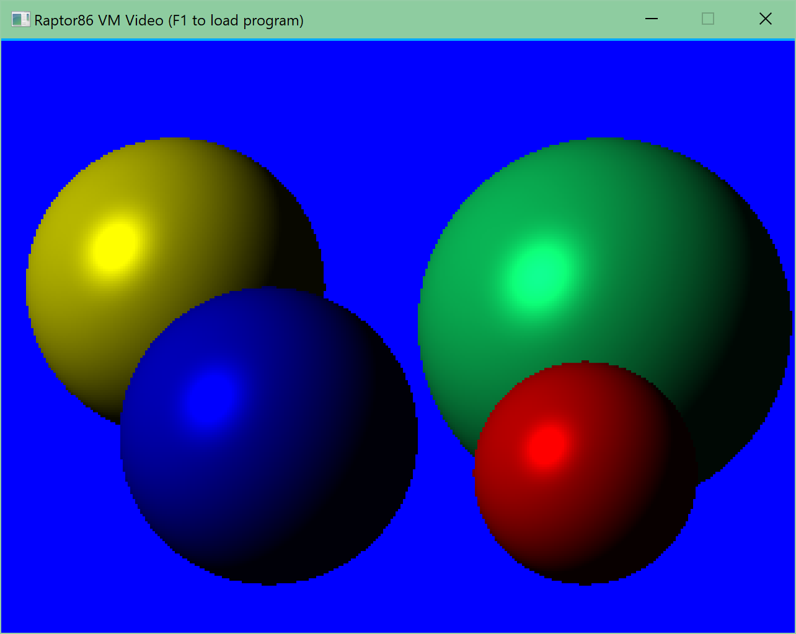
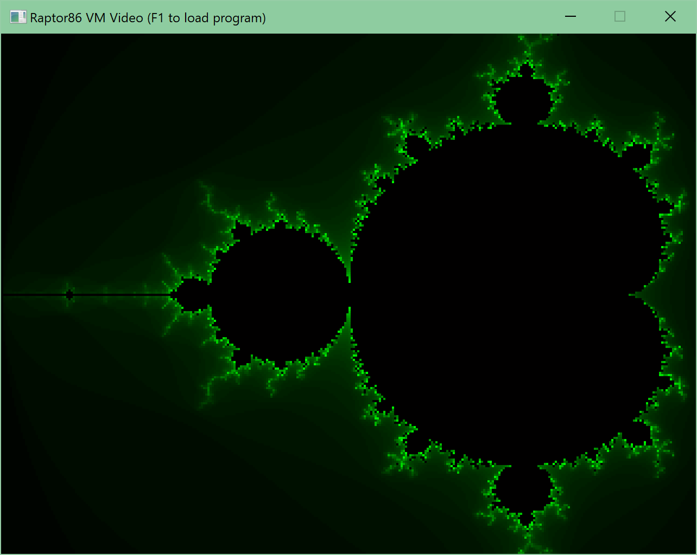

Raptor86
========
A toy virtual machine based on the x86-87 instruction set made in my spare time. From time to time, I tinker with it to improve performance and add functionality.
Everything is MIT-licensed, so feel free to use it as you see fit. If you are a teacher and you are interested in using the project for a class, I would love to assist. Please contact me if you'd like.

Screenshots
===========

Documentation
=============
For unassembled versions of programs, check the "Assembly" folder in the Raptor86 Assembler source directory. The most complex one is "raytracer-buffered.rasm".

For the VM binary and compiled programs, check the "bin" folder.

SDL has been included to create a surface as video output for the Raptor86. SDL is not tied to the project, you may use any video output system. The virtual machine can also run without video output. 

At the time of writing, this project is NOT cross-platform. See "Future plans" below for more information.

Assembly example
================
The assembly is non-standard, but resembles bare x86-64 assembly code.

It has a few extra things, mostly to ease writing programs.

Here are some examples of syntax and functionality:

<pre><code>; Semicolon for comments
; You can set-up global variables, they will be copied into memory at run-time.
; The assembler infers the type automatically - but will always allocate enough to hold a float/int.
$global1 = 38;
$global2 = 68.99f;
$global3 = 0;

; You can also directly include binary data - see the included examples for use cases.
; We've included &global5 here as a dummy, it's address marks the end of binary data from $global4.
$global4 = incbin "test.txt";
$global5 = 0;

; You can use them just like any register, just be sure to append the '$'
; Use '[' and ']' to dereference, in the case of dealing with addresses.
lea r0, $global1
add [r0], 4
mov $global2, [r0]
uif $global2

; Functions and labels can be defined by prefixing '?'.
; They can be called or jumped to globally, there is no scoping available.
?dothing:
  add $global3, 1
  
; There is obviously no memory management or memory protection, you can write to wherever you want.
; There is no execution from memory, so it's not possible to create self-modifying code.
mov r0, 0xff ; Hex is supported
add [r0], r1

; Here's how you could read and print text data from an included binary file.
lga r1, $global5
lga r0, $global4
	
?_Loop:
	cprint [r0]
	inc r0
	cmp r0, r1
	jne ?_Loop

; Lastly, you can affix literal number values to let the assembler know which type you want.
; This is important for specific functions
mov r0, 0.5f ; Float
fmul r0, 4.0f
ftoi r0
imul r0, -21s ; Signed integer 
</code></pre>
  
List of instructions
====================
The instruction set is easy to understand, but has its quirks. For example, I have opted to use dedicated instructions for floating-point math.
It is complete, in that you could write anything with this set. 

Here is the list of instructions, with optional comments where deemed necessary:
| Instructions | Comments                                                                        |
|--------------|---------------------------------------------------------------------------------|
| ADD          |                                                                                 |
| AND          |                                                                                 |
| ASYNCK       | Similar to GetAsyncKeyState() on Windows. Requires user to register a callback. |
| CALL         | Works like a jump, but backs up the EBP and ESP registers. There are no calling conventions, so you are free to use what you'd like. |
| CPRINT       | Helper instruction; prints an 8-bit char to stdout.                             |
| CMP          | Works exactly like x86's CMP. Sets the ZF and CF flags depending on operands. Please use FCOM for floating-point operands. |
| DEC          |                                                                                 |
| DIV          |                                                                                 |
| EPILOG       | Helper instruction; restores the stack pointer from the base pointer register.  |
| FABS         |                                                                                 |
| FADD         |                                                                                 |
| FATAN        |                                                                                 |
| FCHS         | Toggles the sign-bit of a floating-point operand.                               |
| FCOM         | A version of CMP for floating-point operands.                                   |
| FCOS         |                                                                                 |
| FDIV         |                                                                                 |
| FMUL         |                                                                                 |
| FPOW         |                                                                                 |
| FPRINT       | Helper instruction; prints a float to stdout.                                   |
| FSIN         |                                                                                 |
| FSQRT        |                                                                                 |
| FSUB         |                                                                                 |
| FTAN         |                                                                                 |
| FTOI         | Helper instruction; converts operand to signed integer in-place.                |
| GETCH        | Not implemented.                                                                |
| IAND         |                                                                                 |
| IDIV         |                                                                                 |
| IMOD         |                                                                                 |
| IMUL         |                                                                                 |
| INC          |                                                                                 |
| INT          | Calls a user-registered interrupt callback function.                            |
| IOR          |                                                                                 |
| IPRINT       | Helper instruction; prints a signed int to stdout.                              |
| IXOR         |                                                                                 |
| JA           |                                                                                 |
| JAE          |                                                                                 |
| JB           |                                                                                 |
| JBE          |                                                                                 |
| JE           |                                                                                 |
| JG           |                                                                                 |
| JGE          |                                                                                 |
| JL           |                                                                                 |
| JLE          |                                                                                 |
| JMP          |                                                                                 |
| JNE          |                                                                                 |
| JNO          |                                                                                 |
| JNS          |                                                                                 |
| JO           |                                                                                 |
| JS           |                                                                                 |
| JZ           |                                                                                 |
| LEA          | Not implemented as an instruction; expanded into equavalent instructions at assembler level. Caveat: You cannot use the first operand of the LEA instruction in the arithmetic of the second operand.|
| LGA          |  Similarly handled to LEA, but for global addresses specifically. Useful for addressing included binary data. |
| MOD          |                                                                                 |
| MOV          |                                                                                 |
| MUL          |                                                                                 |
| NEG          |                                                                                 |
| NOP          |                                                                                 |
| NOT          |                                                                                 |
| OR           |                                                                                 |
| POP          |                                                                                 |
| PROLOG       | Helper instruction; stores the stack pointer in the base pointer register.      |
| PUSH         |                                                                                 |
| RCLR         | Helper instruction; clears the screen.                                          |
| RET          |                                                                                 |
| RGET         | Helper instruction; gets pixel color at set coordinates.                        |
| RPLOT        | Helper instruction; plots pixel at set coordinates. Requires user callback.     |
| RPOS         | Helper instruction; stores the current screen pixel coordinates in a register.  |
| SAL          | Signed shift; <<                                                                |
| SAR          | Signed shift; >>                                                                |
| SHL          | Unsigned shift; <<                                                              |
| SHR          | Unsigned shift; >>                                                              |
| SIF          | Signed to float conversion, in-place.                                           |
| SLEEP        | Routes directly to Windows Sleep().                                             |
| SUB          |                                                                                 |
| TEST         |                                                                                 |
| TIME         | Not implemented.                                                                |
| UIF          | Helper instruction; converts operand to float in-place.                         |
| UPRINT       | Helper instruction; prints an unsigned int to stdout.                           |
| XADD         |                                                                                 |
| XCHG         |                                                                                 |
| XOR          |                                                                                 |

Pre-compilation of opcode+flags variants
========================================
I have now added pre-compiled instruction handlers for common combinations of opcodes and flags (flags are determined by operand types).
This increases the size of the virtual machine dispatch table, but brings a nice performance benefit.
It was achieved by adding a variant of CheckProgramLineFlags with both 'flags' and 'allowedFlags' as template parameters. The compiler can then discard unnecessary checks, leading to less branch misprediction. 

The idea is similar to what modern CPUs implement at hardware-level. Technically speaking, an ADD with two registers as operands and an ADD with two memory locations as operands now are seperate instructions (with the same logic - the difference being in how the memory access is set up.

You may disable this functionality by setting 'ENABLE_HUGE_VARIANTS' to 0. This may be beneficial when debugging.

Future plans
============
I am still not quite done with the project. I'd like to do the following, in no particular order of importance:
* Remove platform dependencies - no more Windows-specific code in the VM itself.
* Write a game in R86, to show that the platform could be used for gameplay.
* Add a platform target for the web; using Emscripten. I'd like to set up a website where one can assemble programs, test them live and share them with others - similar to something like ShaderToy.
* In the same vein; Linux compatibility. 
* Just to see if I can; JIT compilation of R86 programs - so they can run at near-native speed. Right now, on my 3700X, the VM achieves a single-core performance of ~100 Mips, which is quite low.
* Support executable memory: provides self-modifying code and possibly loading of programs on-the-fly.
* Functionality to manipulate file systems, there are no means to do this outside of custom interrupts right now.
* Add audio output/input interrupts.
* Port a NES emulator to R86.
* Add debugging symbols to R86/Visual Studio, so one could step through a program using the original assembler as source - including the ability to 'watch' addresses and registers.
* Port the VM to some silly platform like a smart watch or toaster. Pretty much free if we have an Emscripten version.
